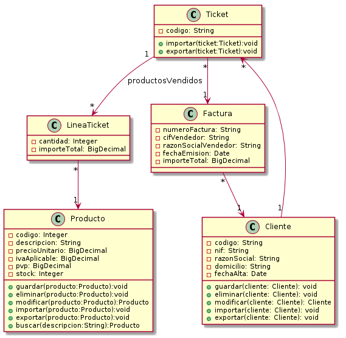

# Primera parte

## ¿Es útil aplicar el Modelo Vista Controlador en esta	situación? Razone la respuesta.

Sí. El patrón arquitectónico MVC divide una aplicación interactiva como la planteada en tres componentes:

- El modelo, que contiene la funcionalidad principal y los datos.
- Las vistas, que presentan la información al usuario.
- Los controladores, que gestionan la entrada del usuario.

Esta separación permite tener múltiples vistas del mismo modelo que, sincronizadas convenientemente, reflejan cualquier cambio producido en cualquiera de ellas.

La aplicación TPV a desarrollar está compuesta de distintos módulos (gestión de inventario, de ventas, de facturación y clientes) que requieren de distintas vistas (presentaciones de la información) e interacciones sobre los mismos datos, lo que hace apropiado el uso de MVC. Además, una aplicación diseñada con esta arquitectura permite cambiar su interfaz (por otra web, por ejemplo) de forma sencilla, lo que es una ventaja de cara a una posible evolución.

## Haga	un pequeño esquema donde se pueda ver claramente de que	tareas	específicas es responsable cada	componente del MVC.	

### Modelo
- Proporciona encapsulamiento de datos y funcionalidad principal de la aplicación.
- Registra las vistas y controladores dependientes.
- Notifica cambios en los datos a los componentes dependientes.
### Vista
- Crea e inicializa su controlador asociado.
- Muestra información al usuario.
- Implementa el proceso de actualización de dicha información.
- Recupera datos del modelo.
### Controlador
- Acepta la entrada del usuario en forma de eventos.
- Traduce los eventos a llamadas de servicio para el modelo o peticiones de visualización a la vista.
- Implementa el procedimiento de actualización de información, en caso de ser necesario.

##¿Será necesario implementar un patrón Observer para recoger los eventos	producidos en la interfaz? Razone la respuesta.	

Si el usuario realiza cambios en el modelo a través del controlador de una vista determinada, el resto de vistas dependientes de dichos datos debería reflejar los cambios. El modelo, por tanto, ha de notificar a todas las vistas de dichos cambios. Las vistas, por su parte, deben recuperar las modificaciones del modelo y actualizar la información mostrada. Este mecanismo de propagación de cambios es el llamado publicador/suscriptor o patrón Observer.

Este mecanismo de propagación de cambios mantiene un registro de los componentes dependientes del modelo. Todas las vistas y los controladores necesarios registran su necesidad de ser informados de cualquier cambio. Un cambio en el modelo dispara el mecanismo de propagación, que se convierte en el único enlace entre el modelo y las vistas y los controladores.

Sí es necesario implementar el patrón Observer, puesto que se trata de un mecanismo que permite propagar los cambios del modelo a las vistas en el patrón MVC.

## Realice un diagrama de clases inicial donde modele los distintos actores de la aplicación, lo que definiría el modelo, e identifique propiedades compartidas entre estos.

# Segunda parte

## ¿Resulta adecuado aplicar Abstract Factory para modelar la incorporación de nuevos productos? Razone su respuesta.

Dada la necesidad de ampliación del inventario del TPV con nuevos productos, es posible afirmar que el patrón *abstract factory* puede ser adecuado si se implementa **utilizando un parámetro en su método de creación** (identificador de clase, entero, cadena, etc.), de manera que dicho parámetro especifique el tipo de objeto a ser creado.

Sin este parámetro, *abstract factory* no facilitaría la extensión del inventario con nuevos productos, ya que la interfaz *AbstractFactory* fija el conjunto de productos que se pueden crear. Permitir nuevos tipos de productos requeriría ampliar la interfaz de la fábrica, lo que a su vez implicaría cambiar la clase *AbstractFactory* y todas sus subclases.

No obstante, aún quedaría un problema subyacente: todos los productos se devolverían al cliente con la misma interfaz abstracta que el tipo de retorno. Es decir, el cliente no podría distinguir o hacer suposiciones seguras sobre la clase de un producto (sí se podría hacer *downcast*, aunque la conversión de tipos podría fallar).

## Implementación

Para ejecutar el ejemplo `Abstract Factory`, basta con ejecutar la clase `AbstractFactoryDemo.java` en el paquete `es.uned.mexposito37.daoo.demos`.

Las clases implicadas en la demostración de este patrón residen en el paquete `es.uned.mexposito37.daoo.model.producto`:

- `ClienteGadgets.java`: cliente que recibe como parámetro una fábrica concreta y muestra en la consola los dos tipos de productos disponibles fabricados.
- `FabricaAbstracta.java`: interfaz de la fábrica abstracta.
- `FabricaLG.java`: fábrica concreta de productos marca LG.
- `FabricaSamsung.java`: fábrica concreta de productos marca Samsung.
- `Movil.java`: producto abstracto que modela un teléfono móvil.
- `MovilLG.java`: producto concreto que modela un teléfono móvil de marca LG.
- `MovilSamsung.java`: producto concreto que modela un teléfono móvil de marca Samsung.
- `Producto.java`: producto abstracto genérico que contiene las implementaciones por defecto de los métodos de importación y exportación a CSV.
- `Tablet.java`: producto abstracto que modela una tableta.
- `TabletLG.java`: producto concreto que modela una tableta marca LG.
- `TabletSamsung.java`: producto concreto que modela una tableta marca Samsung.

El resultado de ejecutar la demo muestra por consola dos productos distintos creados para una marca determinada por un parámetro de tipo texto.
 

# Tercera parte

## ¿Resulta adecuado aplicar Decorator para la preparación "customizada" de las facturas? Razone su respuesta.

El patrón `decorator` permite añadir responsabilidades a objetos individuales en vez de a toda una clase. En el caso de la personalización de facturas, podría pensarse en varias estrategias:

- Implementación de vistas personalizadas y uso de herencia en la parte común: esta estrategia podría llevar a una explosión de vistas y al hecho de que la parte común a todas ellas desaparezca en la práctica debido a exigencias de personalización por parte de los clientes. 
- Uso del patrón `decorator`: esta estrategia es más flexible en cuanto a que las personalizaciones se pueden aplicar o no una por una a una vista base, reduciendo la complejidad en este sentido y ofreciendo un diseño menos complejo.

Si bien en este caso el patrón `decorator` no añadirá funcionalidad propiamente dicha, sino que tan sólo modificará la representación de las facturas, es perfectamente aplicable. Un ejemplo del primer caso sería aplicar un descuento a una factura; dicho descuento se implementaría mediante una funcionalidad añadida por un decorador.

## Implementación

Para ejecutar el ejemplo `Decorator`, basta con ejecutar la clase `DecoratorDemo.java` en el paquete `es.uned.mexposito37.daoo.demos`.

Las clases implicadas en la demostración de este patrón residen en el paquete `es.uned.mexposito37.daoo.model.factura`:

- `DecoradorFactura.java`: decorador abstracto de facturas.
- `DecoradorFacturaClienteNoFidelizado.java`: decorador concreto de facturas para clientes no fidelizados, con una personalización específica orientada a este tipo de clientes.
- `DecoradorFacturaClienteVip.java`: decorador concreto de facturas para clientes VIP, con una personalización específica orientada a este tipo de clientes.
- `Factura.java`: factura abstracta que implementa el método toString() base.
- `FacturaGenerica.java`: factura concreta sin personalizar derivada de la factura abstracta.

El resultado de ejecutar la demo genera todos los elementos necesarios para obtener dos facturas (clientes, tickets, productos, líneas de tickets) y las presenta por consola con personalizaciones distintas en función del tipo de cliente (sin fidelizar o VIP). 

# Cuarta parte

## ?Resulta adecuado aplicar Memento para modelar el estado de la lista? Razone su respuesta.

La utilización del patrón memento para modelar el estado de la lista y permitir una funcionalidad de "deshacer" puede tener sentido en función del tipo de "guardado" y restauración que se desee implementar. Por ejemplo:

Si el cliente sólo puede elegir los productos de uno en uno y tan sólo se desea permitir un deshacer en la lista que lleve al estado anterior, bastaría con eliminar el último elemento de la lista.

Para el ejemplo que atañe a la práctica, se supondrá que se desea permitir volver a un estado anterior que implique "deseleccionar" varios productos a la vez. En este caso, el patrón memento cumple a la perfección su propósito.

Para la implementación de este patrón se opta por una clase privada dentro de la propia clase Cliente que tan sólo cuenta con un constructor privado. De esta forma se asegura que, incluso si el objeto memento se almacena en algún lugar fuera de un objeto Cliente, ningún otro objeto será capaz de usar el objeto o modificar su estado. Esto es consistente con el rol del patrón memento: producir un objeto que mantenga una instantánea de estado que no pueda ser modificado por otros objetos del sistema.

## Implementación

Para ejecutar el ejemplo `Memento`, basta con ejecutar la clase `MementoDemo.java` en el paquete `es.uned.mexposito37.daoo.demos`.

Las clases implicadas en la demostración de este patrón residen en el paquete `es.uned.mexposito37.daoo.model.factura`:

- `Cliente.java`: contiene el memento con la lista de facturas asociadas a cada cliente, además de los métodos propios de la clase.

El resultado de ejecutar la demo genera todos los objetos necesarios para asociar varias facturas a un cliente y muestra por consola las facturas asociadas al mismo en un momento dado (antes de deshacer) y en un momento posterior, una vez realizada la operación deshacer. Previamente a la realización de la operación deshacer, el estado de la lista de facturas se guarda en un memento.

# Tarea Opcional

Dentro de este apartado se enumeran las integraciones o funcionalidades opcionales añadidas de cara a su evaluación:

## Persistencia del modelo

Se ha optado por utilizar la biblioteca [superCSV](http://super-csv.github.io/super-csv/index.html) para implementar la persistencia de objetos. La aplicación permite exportar e importar las entidades del modelo a archivos CSV. La biblioteca presenta funcionalidades de validación de campos a la hora de realizar la importación que se han aprovechado en la implementación de la práctica.

## Pruebas unitarias

Se han incluido pruebas unitarias utilizando la biblioteca [JUnit](http://junit.org/junit4/) para garantizar el correcto funcionamiento de las pruebas de concepto llevadas a cabo para implementar la aplicación (sobre todo derivadas de la persistencia de objetos).

## GUI

Se ha implementado parte de la GUI con Swing a modo de prueba de concepto, demostrando interacciones entre todas las capas del modelo MVC.

# ANEXOS

## PARTE 2

	/*
	 * Clase demostración del patrón abstract factory.
	 */
	package es.uned.mexposito37.daoo.demos;
	
	import es.uned.mexposito37.daoo.model.producto.ClienteGadgets;
	import es.uned.mexposito37.daoo.model.producto.FabricaAbstracta;
	import es.uned.mexposito37.daoo.model.producto.FabricaLG;
	import es.uned.mexposito37.daoo.model.producto.FabricaSamsung;
	
	/**
	 * Clase demostración del patrón abstract factory.
	 */
	public class AbstractFactoryDemo {
	
		/**
		 * Método main: ejecutar con Eclipse para ver la demostración. En base a la
		 * marca Samsung invoca a un cliente pasándole la fábrica correspondiente
		 * como argumento. El cliente genera dos productos distintos de esta marca.
		 *
		 * @param args
		 *            argumentos
		 */
		public static void main(String[] args) {
	
			ClienteGadgets cliente = new ClienteGadgets();
			String marca = "Samsung"; // o LG
			FabricaAbstracta fabricaProducto = null;
	
			if (marca.equals("Samsung")) {
				fabricaProducto = new FabricaSamsung();
			} else {
				fabricaProducto = new FabricaLG();
			}
			cliente.fabricarGadget(fabricaProducto);
		}
	
	}

	/* Clase ClienteGadgets: fabrica productos en función de la fábrica que reciba como parámetro.
	 */
	package es.uned.mexposito37.daoo.model.producto;
	
	/**
	 * Clase ClienteGadgets: fabrica productos en función de la fábrica que reciba
	 * como parámetro.
	 */
    public class ClienteGadgets {

	/**
	 * Constructor vacío por defecto para instanciar un cliente.
	 */
	public ClienteGadgets() {

	}

	/**
	 * Fabricar gadget: fabrica un gadget según la fábrica recibida como
	 * parámetro.
	 *
	 * @param fabrica
	 *            the fabrica
	 */
	public void fabricarGadget(FabricaAbstracta fabrica) {
		Movil movil = fabrica.crearMovil();
		movil.setCodigo("9876543219876");
		movil.setDescripcion("Smartphone de 5'");
		Tablet tablet = fabrica.crearTablet();
		tablet.setCodigo("9876543219878");
		tablet.setDescripcion("Tableta de 7'");

		System.out.println(movil.toString());
		System.out.println(tablet.toString());

	}
}

	* Interfaz FabricaAbstracta, que deben implementar las fábricas de los distintos productos.
	 */
	package es.uned.mexposito37.daoo.model.producto;
	
	/**
	 * Interfaz FabricaAbstracta que deben implementar las fábricas de los distintos
	 * productos.
	 */
    public interface FabricaAbstracta {

	/**
	 * Crear movil: crea un producto de tipo teléfono móvil.
	 *
	 * @return movil
	 */
	public Movil crearMovil();

	/**
	 * Crear tablet: crea un producto de tipo tableta.
	 *
	 * @return tablet
	 */
	public Tablet crearTablet();

}

	* Clase FabricaLG: fabrica un mógil de marca LG. Implementa la fábrica abstracta correspondiente.
	 */
	package es.uned.mexposito37.daoo.model.producto;
	
	/**
	 * Clase FabricaLG: fabrica un móvil de marca LG
	 */
	public class FabricaLG implements FabricaAbstracta {

	/*
	 * (non-Javadoc)
	 * 
	 * @see
	 * es.uned.mexposito37.daoo.model.producto.FabricaAbstracta#crearMovil()
	 */
	public Movil crearMovil() {
		return new MovilLG();
	}

	/*
	 * (non-Javadoc)
	 * 
	 * @see
	 * es.uned.mexposito37.daoo.model.producto.FabricaAbstracta#crearTablet()
	 */
	public Tablet crearTablet() {
		return new TabletLG();
	}

}

	/*
	 * Clase FabricaLG: fabrica un mógil de marca LG. Implementa la fábrica abstracta correspondiente.
	 */
	package es.uned.mexposito37.daoo.model.producto;
	
	/**
	 * Clase FabricaSamsung: fabrica un móvil de marca Samsung.
	 */
	public class FabricaSamsung implements FabricaAbstracta {

	/*
	 * (non-Javadoc)
	 * 
	 * @see
	 * es.uned.mexposito37.daoo.model.producto.FabricaAbstracta#crearMovil()
	 */
	public Movil crearMovil() {
		return new MovilSamsung();
	}

	/*
	 * (non-Javadoc)
	 * 
	 * @see
	 * es.uned.mexposito37.daoo.model.producto.FabricaAbstracta#crearTablet()
	 */
	public Tablet crearTablet() {
		return new TabletSamsung();
	}

}

	* Clase abstracta móvil: modela un producto de tipo móvil sin marca.
	 */
	package es.uned.mexposito37.daoo.model.producto;
	
	import java.math.BigDecimal;
	
	/**
	 * Clase Movil: modela un producto de tipo móvil sin marca.
	 */
	public abstract class Movil extends Producto {

	/**
	 * Constructor vacío por defecto.
	 */
	public Movil() {

	}

	/**
	 * Constructor con parámetros: instancia un nuevo móvil.
	 *
	 * @param codigo
	 *            codigo
	 * @param descripcion
	 *            descripcion
	 * @param precio
	 *            precio
	 * @param iva
	 *            iva
	 * @param stock
	 *            stock
	 */
	public Movil(String codigo, String descripcion, BigDecimal precio, Integer iva, Integer stock) {
		super(codigo, descripcion, precio, iva, stock);
	}
}

	* Clase MovilLG: modela un producto de tipo movil y de marca LG.
	 */
	package es.uned.mexposito37.daoo.model.producto;
	
	import java.math.BigDecimal;
	
	/**
	 * Clase MovilLG: modela un producto de tipo movil y de marca LG.
	 */
	public class MovilLG extends Movil {

	/**
	 * Constructor vacío por defecto.
	 */
	public MovilLG() {

	}

	/**
	 * Constructor con parámetros: instancia un nuevo objeto movil lg.
	 *
	 * @param codigo
	 *            codigo
	 * @param descripcion
	 *            descripcion
	 * @param precio
	 *            precio
	 * @param iva
	 *            iva
	 * @param stock
	 *            stock
	 */
	public MovilLG(String codigo, String descripcion, BigDecimal precio, int iva, int stock) {

		super(codigo, descripcion, precio, iva, stock);
	}

	/*
	 * (non-Javadoc)
	 * 
	 * @see es.uned.mexposito37.daoo.model.producto.Producto#toString()
	 */
	@Override
	public String toString() {

		return "Móvil LG " + this.getCodigo() + " - " + this.getDescripcion();
	}

}

	/*
	 * Clase MovilSamsung: modela un producto de tipo movil y de marca Samsung.
	 */
	package es.uned.mexposito37.daoo.model.producto;
	
	import java.math.BigDecimal;
	
	/**
	 * Clase MovilSamsung: modela un producto de tipo movil y de marca Samsung.
	 */
	public class MovilSamsung extends Movil {

	/**
	 * Constructor vacío por defecto.
	 */
	public MovilSamsung() {

	}

	/**
	 * Constructor con parámetros: instancia un nuevo objeto movil Samsung.
	 *
	 * @param codigo
	 *            codigo
	 * @param descripcion
	 *            descripcion
	 * @param precio
	 *            precio
	 * @param iva
	 *            iva
	 * @param stock
	 *            stock
	 */
	public MovilSamsung(String codigo, String descripcion, BigDecimal precio, int iva, int stock) {

		super(codigo, descripcion, precio, iva, stock);
	}

	/*
	 * (non-Javadoc)
	 * 
	 * @see es.uned.mexposito37.daoo.model.producto.Producto#toString()
	 */
	@Override
	public String toString() {

		return "Móvil Samsung " + this.getCodigo() + " - " + this.getDescripcion();
	}

    }

	/*
	 * Clase abstracta producto: modela un producto genérico y sus operaciones comunes.
	 */
	package es.uned.mexposito37.daoo.model.producto;
	
	import java.io.FileReader;
	import java.io.FileWriter;
	import java.math.BigDecimal;
	import java.util.ArrayList;
	import java.util.List;
	
	import org.supercsv.cellprocessor.ParseBigDecimal;
	import org.supercsv.cellprocessor.ParseInt;
	import org.supercsv.cellprocessor.constraint.NotNull;
	import org.supercsv.cellprocessor.constraint.UniqueHashCode;
	import org.supercsv.cellprocessor.ift.CellProcessor;
	import org.supercsv.io.CsvBeanReader;
	import org.supercsv.io.CsvBeanWriter;
	import org.supercsv.io.ICsvBeanReader;
	import org.supercsv.io.ICsvBeanWriter;
	import org.supercsv.prefs.CsvPreference;
	
	/**
	 * Clase abstracta producto: modela un producto genérico y sus operaciones
	 * comunes.
	 */
	public abstract class Producto {

	final static String CSV_FILENAME = "./data/productos.csv";

	private String codigo;
	private String descripcion;
	private BigDecimal precio;
	private Integer iva;
	private BigDecimal pvp;
	private Integer stock;

	/**
	 * Constructor vacío por defecto.
	 */
	public Producto() {

	}

	/**
	 * Constructor con parámetros: instancia un nuevo producto.
	 *
	 * @param codigo
	 *            codigo
	 * @param descripcion
	 *            descripcion
	 * @param precio
	 *            precio
	 * @param iva
	 *            iva
	 * @param stock
	 *            stock
	 */
	public Producto(String codigo, String descripcion, BigDecimal precio, Integer iva, Integer stock) {
		this.codigo = codigo;
		this.descripcion = descripcion;
		this.precio = precio;
		this.iva = iva;
		this.pvp = precio.multiply(new BigDecimal((1 + (double) iva / (double) 100)));
		this.stock = stock;
	}

	public String getCodigo() {
		return codigo;
	}

	public void setCodigo(String codigo) {
		this.codigo = codigo;
	}

	public String getDescripcion() {
		return descripcion;
	}

	public void setDescripcion(String descripcion) {
		this.descripcion = descripcion;
	}

	public BigDecimal getPrecio() {
		return precio;
	}

	public void setPrecio(BigDecimal precio) {
		this.precio = precio;
	}

	public Integer getIva() {
		return iva;
	}

	public void setIva(Integer iva) {
		this.iva = iva;
	}

	public BigDecimal getPvp() {
		return pvp;
	}

	public void setPvp(BigDecimal pvp) {
		this.pvp = pvp;
	}

	public Integer getStock() {
		return stock;
	}

	public void setStock(Integer stock) {
		this.stock = stock;
	}

	/*
	 * (non-Javadoc)
	 * 
	 * @see java.lang.Object#toString()
	 */
	public String toString() {

		return this.getCodigo() + " - " + this.getDescripcion();
	}

	/**
	 * Inicializa el procesador de lectura de campos, uno por cada columna. Las
	 * columnas vacías se leen como null.
	 * 
	 * 
	 * @return procesador de celdas
	 */
	public static CellProcessor[] getReadProcessors() {

		final CellProcessor[] processors = new CellProcessor[] { new UniqueHashCode(), // código
																						// de
																						// producto
				new NotNull(), // descripción
				new ParseBigDecimal(), // precio sin iva
				new ParseInt(), // iva
				new ParseBigDecimal(), // pvp
				new ParseInt() // stock
		};

		return processors;
	}

	/**
	 * Inicializa el procesador de escritura de campos, uno por cada columna.
	 * 
	 * 
	 * @return procesador de celdas
	 */
	public static CellProcessor[] getWriteProcessors() {

		final CellProcessor[] processors = new CellProcessor[] { new UniqueHashCode(), // código
																						// de
																						// producto
				new NotNull(), // descripción
				new NotNull(), // precio sin iva
				new NotNull(), // iva
				new NotNull(), // pvp
				new NotNull() // stock

		};

		return processors;
	}

	/**
	 * Importar: importa productos desde archivo.
	 *
	 * @param clase
	 *            clase
	 * @return lista de productos
	 * @throws Exception
	 *             exception genérica
	 */
	public static List<Producto> importar(Class clase) throws Exception {

		ICsvBeanReader beanReader = null;
		List<Producto> productos = new ArrayList<Producto>();
		try {
			beanReader = new CsvBeanReader(new FileReader(CSV_FILENAME), CsvPreference.STANDARD_PREFERENCE);
			final String[] header = beanReader.getHeader(true);
			final CellProcessor[] processors = getReadProcessors();
			Producto producto;
			while ((producto = beanReader.read(clase, header, processors)) != null) {
				productos.add(producto);

			}

		} finally {
			if (beanReader != null) {
				beanReader.close();

			}

		}
		return productos;
	}

	/**
	 * Exportar: exporta productos a archivo.
	 *
	 * @param productos
	 *            los productos
	 * @throws Exception
	 *             exception genérica
	 */
	public static void exportar(List<Producto> productos) throws Exception {

		ICsvBeanWriter beanWriter = null;
		try {
			beanWriter = new CsvBeanWriter(new FileWriter(CSV_FILENAME), CsvPreference.STANDARD_PREFERENCE);

			// the header elements are used to map the bean values to each
			// column (names must match)
			final String[] header = new String[] { "codigo", "descripcion", "precio", "iva", "pvp", "stock" };
			final CellProcessor[] processors = getWriteProcessors();

			// write the header
			beanWriter.writeHeader(header);

			// write the beans
			for (final Producto producto : productos) {

				beanWriter.write(producto, header, processors);
			}

		} finally {
			if (beanWriter != null) {
				beanWriter.close();
			}
		}
	}

	/**
	 * Append: añade un producto a un fichero con productos ya existente.
	 *
	 * @throws Exception
	 *             exception genérica
	 */
	public void append() throws Exception {
		ICsvBeanWriter beanWriter = null;
		try {
			beanWriter = new CsvBeanWriter(new FileWriter(CSV_FILENAME, true), CsvPreference.STANDARD_PREFERENCE);

			// the header elements are used to map the bean values to each
			// column (names must match)
			final String[] header = new String[] { "codigo", "descripcion", "precio", "iva", "pvp", "stock" };
			final CellProcessor[] processors = getWriteProcessors();

			beanWriter.write(this, header, processors);

		} finally {
			if (beanWriter != null) {
				beanWriter.close();
			}
		}
	}
	}
	
	/*
	 * Clase abstracta tablet: modela un producto de tipo tableta sin marca.
	 */
	package es.uned.mexposito37.daoo.model.producto;
	
	import java.math.BigDecimal;
	
	/**
	 * Clase abstracta tablet: modela un producto de tipo tableta sin marca.
	 */
	public abstract class Tablet extends Producto {

	/**
	 * Constructor vacío por defecto.
	 */
	public Tablet() {

	}

	/**
	 * Constructor con parámetros: instancia un nuevo móvil.
	 *
	 * @param codigo
	 *            codigo
	 * @param descripcion
	 *            descripcion
	 * @param precio
	 *            precio
	 * @param iva
	 *            iva
	 * @param stock
	 *            stock
	 */
	public Tablet(String codigo, String descripcion, BigDecimal precio, Integer iva, Integer stock) {
		super(codigo, descripcion, precio, iva, stock);
	}

	}
	
	/*
	 * Clase TabletLG: modela un producto de tipotableta y de marca LG.
	 */
	package es.uned.mexposito37.daoo.model.producto;
	
	import java.math.BigDecimal;
	
	/**
	 * Clase MovilLG: modela un producto de tipo tableta y de marca LG.
	 */
	public class TabletLG extends Tablet {
	
	/**
	 *  Constructor vacío por defecto.
	 */
	public TabletLG(){
		
	}

	/**
	 * Constructor con parámetros: instancia un nuevo objeto tablet lg.
	 *
	 * @param codigo codigo
	 * @param descripcion descripcion
	 * @param precio precio
	 * @param iva iva
	 * @param stock stock
	 */
	public TabletLG(String codigo, String descripcion, BigDecimal precio, int iva, int stock) {
		
		super(codigo, descripcion, precio, iva,  stock);
	}
	

	/* (non-Javadoc)
	 * @see es.uned.mexposito37.daoo.model.producto.Producto#toString()
	 */
	@Override
	 public String toString() {
	    	
	    	return "Tablet LG " + this.getCodigo() + " - " + this.getDescripcion();
	    }

	
	}
	
	/*
	 * Clase TabletSamsung: modela un producto de tipo tablet y de marca Samsung.
	 */
	package es.uned.mexposito37.daoo.model.producto;
	
	import java.math.BigDecimal;
	
	/**
	 * Clase TabletSamsung: modela un producto de tipo tablet y de marca Samsung.
	 */
	public class TabletSamsung extends Tablet {

	/**
	 * Constructor vacío por defecto.
	 */
	public TabletSamsung() {

	}

	/**
	 * Constructor con parámetros: instancia un nuevo objeto movil Samsung.
	 *
	 * @param codigo
	 *            codigo
	 * @param descripcion
	 *            descripcion
	 * @param precio
	 *            precio
	 * @param iva
	 *            iva
	 * @param stock
	 *            stock
	 */
	public TabletSamsung(String codigo, String descripcion, BigDecimal precio, int iva, int stock) {

		super(codigo, descripcion, precio, iva, stock);
	}

	/*
	 * (non-Javadoc)
	 * 
	 * @see es.uned.mexposito37.daoo.model.producto.Producto#toString()
	 */
	@Override
	public String toString() {

		return "Tablet Samsung " + this.getCodigo() + " - " + this.getDescripcion();
	}

}

## PARTE 3
	/*
	 * Clase demostración del patrón decorator.
	 */
	package es.uned.mexposito37.daoo.demos;
	
	import java.math.BigDecimal;
	import java.util.Date;
	
	import es.uned.mexposito37.daoo.model.Cliente;
	import es.uned.mexposito37.daoo.model.LineaTicket;
	import es.uned.mexposito37.daoo.model.Ticket;
	import es.uned.mexposito37.daoo.model.factura.DecoradorFacturaClienteNoFidelizado;
	import es.uned.mexposito37.daoo.model.factura.DecoradorFacturaClienteVip;
	import es.uned.mexposito37.daoo.model.factura.Factura;
	import es.uned.mexposito37.daoo.model.factura.FacturaGenerica;
	import es.uned.mexposito37.daoo.model.producto.MovilLG;
	import es.uned.mexposito37.daoo.model.producto.MovilSamsung;
	import es.uned.mexposito37.daoo.model.producto.Producto;
	
	/**
	 * Clase demostración del patrón decorator.
	 */
	public class DecoratorDemo {
	
		/**
		 * Método principal: ejecutar con Eclipse para ver la demostración.
		 * Instancia los clientes, tickets, productos y líneas de tickets necesarios
		 * para generar dos facturas que se decorarán convenientemente. Se muestra
		 * por pantalla el resultado para ambas.
		 *
		 * @param args
		 *            argumentos
		 */
		public static void main(String[] args) {
	
			Cliente clienteVip = new Cliente("12345", "72056097H", "Miguel Expósito Martín", "c\\ El Campizo 10 2A",
					new Date("02/04/2016"));
			Cliente clienteNoFidelizado = new Cliente("12346", "72090875J", "Pepito Pérez",
					"c\\ Las Acacias 2, esc. izq, 5ºB", new Date("15/04/2016"));
			Ticket primerTicket = new Ticket("00001", clienteVip);
			Ticket segundoTicket = new Ticket("00002", clienteVip);
			Ticket tercerTicket = new Ticket("00003", clienteNoFidelizado);
			Producto primerProducto = new MovilSamsung("1234567891236", "Samsung Galaxy S7", new BigDecimal("517.39"), 21,
					5);
			Producto segundoProducto = new MovilLG("1234567891237", "LG G3", new BigDecimal("222.31"), 21, 10);
			Producto tercerProducto = new MovilLG("1234567891238", "LG G4", new BigDecimal("305.781"), 21, 10);
			LineaTicket primeraLineaTicket = new LineaTicket(2, primerProducto, primerTicket);
			LineaTicket segundaLineaTicket = new LineaTicket(1, segundoProducto, primerTicket);
			LineaTicket terceraLineaTicket = new LineaTicket(1, tercerProducto, segundoTicket);
			LineaTicket cuartaLineaTicket = new LineaTicket(1, tercerProducto, tercerTicket);
			Factura facturaClienteVip = new FacturaGenerica("2016/1", "Q3900764F", "The Phone House",
					new Date("01/05/2016"), clienteVip);
			facturaClienteVip.addToTickets(primerTicket);
			facturaClienteVip.addToTickets(segundoTicket);
			Factura facturaClienteNoFidelizado = new FacturaGenerica("2016/2", "Q3900764F", "The Phone House",
					new Date("03/05/2016"), clienteNoFidelizado);
			facturaClienteNoFidelizado.addToTickets(tercerTicket);
			DecoradorFacturaClienteVip decoradorFacturaClienteVip = new DecoradorFacturaClienteVip(facturaClienteVip);
			DecoradorFacturaClienteNoFidelizado decoradorFacturaClienteNoFidelizado = new DecoradorFacturaClienteNoFidelizado(
					facturaClienteNoFidelizado);
			System.out.println(decoradorFacturaClienteVip.toString());
			System.out.println(decoradorFacturaClienteNoFidelizado.toString());
		}
	
	}

	/*
	 * Clase abstracta DecoradorFactura de la que heredarán los decoradores concretos.
	 */
	package es.uned.mexposito37.daoo.model.factura;
	
	import java.util.Date;
	import es.uned.mexposito37.daoo.model.Cliente;
	
	
	/**
	 * Class DecoradorFactura.
	 */
	public abstract class DecoradorFactura extends Factura {
	
		/**
		 * Constructor vacío por defecto, aunque la clase no será instanciable.
		 */
		public DecoradorFactura() {
			
		}
	
		/**
		 * Constructor con parámetros a heredar por decoradores concretos.
		 *
		 * @param numeroFactura el numero factura
		 * @param cifVendedor el cif vendedor
		 * @param razonSocialVendedor el razon social vendedor
		 * @param fechaEmision el fecha emision
		 * @param cliente el cliente
		 */
		public DecoradorFactura(String numeroFactura, String cifVendedor, String razonSocialVendedor, Date fechaEmision,
				 Cliente cliente) {
			super(numeroFactura, cifVendedor, razonSocialVendedor, fechaEmision, cliente);
			
		}
		
		Factura factura;
		
		/* (non-Javadoc)
		 * @see es.uned.mexposito37.daoo.model.factura.Factura#toString()
		 */
		public String toString() {
			return "";
		}
	
	}
	
	/*
	 * Clase DecoradorFacturaClienteNoFidelizado: decorador concreto para facturas de clientes no fidelizados.
	 */
	package es.uned.mexposito37.daoo.model.factura;
	
	/**
	 * Clase DecoradorFacturaClienteNoFidelizado: decorador concreto para facturas
	 * de clientes no fidelizados.
	 */
	public class DecoradorFacturaClienteNoFidelizado extends DecoradorFactura {
	
		/**
		 * Constructor vacío por defecto: instancia un nuevo decorador de facturas
		 * de cliente no fidelizado.
		 */
		public DecoradorFacturaClienteNoFidelizado() {
	
		}
	
		/**
		 * Constructor con parámetros: Instancia un nuevo decorador de facturas de
		 * cliente no fidelizado.
		 *
		 * @param facturaCliente
		 *            la factura de cliente.
		 */
		public DecoradorFacturaClienteNoFidelizado(Factura facturaCliente) {
			factura = facturaCliente;
		}
	
		private String customization = "\nDisfrute de increíbles descuentos haciéndose cliente VIP en thephonehouse.com o llamando al 1145.";
	
		/**
		 * Añade texto personalizado a la descripción de la factura.
		 *
		 * @param description
		 *            descripción de la factura
		 * @return string
		 */
		private String addCustomization(String description) {
			return description + customization;
		}
	
		/*
		 * (non-Javadoc)
		 * 
		 * @see es.uned.mexposito37.daoo.model.factura.DecoradorFactura#toString()
		 */
		@Override
		public String toString() {
	
			return addCustomization(factura.toString());
		}
	
	}
	
	/*
	 * Clase DecoradorFacturaClienteNoFidelizado: decorador concreto para facturas de clientes vip.
	 */
	package es.uned.mexposito37.daoo.model.factura;
	
	/**
	 * Clase DecoradorFacturaClienteNoFidelizado: decorador concreto para facturas
	 * de clientes vip.
	 */
	public class DecoradorFacturaClienteVip extends DecoradorFactura {
	
		/**
		 * Constructor vacío por defecto: instancia un nuevo decorador de facturas
		 * de cliente vip.
		 */
		public DecoradorFacturaClienteVip() {
	
		}
	
		/**
		 * Constructor con parámetros: Instancia un nuevo decorador de facturas de
		 * cliente vip.
		 *
		 * @param facturaCliente
		 *            la factura de cliente.
		 */
		public DecoradorFacturaClienteVip(Factura facturaCliente) {
			factura = facturaCliente;
		}
	
		private String customization = "\nPor ser cliente especial, disfrute de nuestras mejores ofertas y descuentos de hasta el 20% en nuestros artículos.";
	
		/**
		 * Añade texto personalizado a la descripción de la factura.
		 *
		 * @param description
		 *            descripción de la factura
		 * @return string
		 */
	
		private String addCustomization(String description) {
			return description + customization;
		}
	
		/*
		 * (non-Javadoc)
		 * 
		 * @see es.uned.mexposito37.daoo.model.factura.DecoradorFactura#toString()
		 */
		@Override
		public String toString() {
	
			return addCustomization(factura.toString());
		}
	
	}
	
	/*
	 * Clase abstracta Factura que modela la entidad del mismo nombre a modo de POJO, de la que heredarán las facturas concretas.
	 */
	package es.uned.mexposito37.daoo.model.factura;
	
	import java.math.BigDecimal;
	import java.math.RoundingMode;
	import java.util.ArrayList;
	import java.util.Date;
	import java.util.List;
	
	import es.uned.mexposito37.daoo.model.Cliente;
	import es.uned.mexposito37.daoo.model.LineaTicket;
	import es.uned.mexposito37.daoo.model.Ticket;
	
	/**
	 * Clase Factura que modela la entidad del mismo nombre a modo de POJO.
	 */
	public abstract class Factura {
	
		private String numeroFactura;
		private String cifVendedor;
		private String razonSocialVendedor;
		private Date fechaEmision;
		private BigDecimal importeTotal;
		private Cliente cliente;
		private List<Ticket> tickets;
	
		/**
		 * Constructor vacío para uso de superCSV.
		 */
		public Factura() {
	
		}
	
		/**
		 * Constructor con parámetros: instancia una nueva factura.
		 *
		 * @param numeroFactura
		 *            numero factura
		 * @param cifVendedor
		 *            cif vendedor
		 * @param razonSocialVendedor
		 *            razon social vendedor
		 * @param fechaEmision
		 *            fecha emision
		 * @param cliente
		 *            cliente
		 */
		public Factura(String numeroFactura, String cifVendedor, String razonSocialVendedor, Date fechaEmision,
				Cliente cliente) {
			super();
			this.numeroFactura = numeroFactura;
			this.cifVendedor = cifVendedor;
			this.razonSocialVendedor = razonSocialVendedor;
			this.fechaEmision = fechaEmision;
			this.cliente = cliente;
			this.tickets = new ArrayList();
			this.importeTotal = new BigDecimal(0);
			this.cliente.addToFacturas(this);
		}
	
		public String getNumeroFactura() {
			return numeroFactura;
		}
	
		public void setNumeroFactura(String numeroFactura) {
			this.numeroFactura = numeroFactura;
		}
	
		public String getCifVendedor() {
			return cifVendedor;
		}
	
		public void setCifVendedor(String cifVendedor) {
			this.cifVendedor = cifVendedor;
		}
	
		public String getRazonSocialVendedor() {
			return razonSocialVendedor;
		}
	
		public void setRazonSocialVendedor(String razonSocialVendedor) {
			this.razonSocialVendedor = razonSocialVendedor;
		}
	
		public Date getFechaEmision() {
			return fechaEmision;
		}
	
		public void setFechaEmision(Date fechaEmision) {
			this.fechaEmision = fechaEmision;
		}
	
		public BigDecimal getImporteTotal() {
			return importeTotal;
		}
	
		public void setImporteTotal(BigDecimal importeTotal) {
			this.importeTotal = importeTotal;
		}
	
		public Cliente getCliente() {
			return cliente;
		}
	
		public void setCliente(Cliente cliente) {
			this.cliente = cliente;
		}
	
		public List<Ticket> getTickets() {
			return tickets;
		}
	
		/**
		 * Añade ticket a la lista de tickets y los importes totales a las líneas de
		 * tickets.
		 *
		 * @param ticket
		 *            el ticket
		 */
		public void addToTickets(Ticket ticket) {
			this.tickets.add(ticket);
			for (LineaTicket lt : ticket.getLineasTicket()) {
				this.setImporteTotal(this.importeTotal.add(lt.getImporteTotal()));
			}
	
		}
	
		/*
		 * (non-Javadoc)
		 * 
		 * @see java.lang.Object#toString()
		 */
		@Override
		public String toString() {
	
			String productos = "";
	
			for (Ticket t : this.getTickets()) {
				for (LineaTicket lt : t.getLineasTicket()) {
					productos += "Producto: " + lt.getProducto().getDescripcion() + ", Ticket: " + t.getCodigo()
							+ ", Cantidad: " + lt.getUnidadesVendidas() + ", Subtotal: "
							+ lt.getImporteTotal().setScale(2, RoundingMode.CEILING) + "\n";
				}
			}
	
			return "\n----------------------------------\n" + "Datos de la Factura: \n" + "Factura no.: "
					+ this.getNumeroFactura() + "\n" + "CIF del vendedor: " + this.getCifVendedor() + "\n"
					+ "Razón social del vendedor: " + this.getRazonSocialVendedor() + "\n" + "Fecha de emisión :"
					+ this.getFechaEmision() + "\n" + "Código de cliente :" + this.cliente.getCodigo() + "\n"
					+ "NIF del cliente :" + this.cliente.getNif() + "\n" + "Razón social del cliente: "
					+ this.cliente.getRazonSocial() + "\n" + "Domicilio del cliente: " + this.cliente.getDomicilio() + "\n"
					+ productos + "Importe total: " + this.getImporteTotal().setScale(2, RoundingMode.CEILING);
	
		}
	
	}
	
	/*
	 * Clase factura genérica: modela una factura sin decorar
	 */
	package es.uned.mexposito37.daoo.model.factura;
	
	import java.util.Date;
	
	import es.uned.mexposito37.daoo.model.Cliente;
	
	/**
	 * Clase FacturaGenerica: modela una factura sin decorar.
	 */
	public class FacturaGenerica extends Factura {
	
		/**
		 * Constructor vacío por defecto.
		 */
		public FacturaGenerica() {
			
		}
	
		/**
		 * Constructor con parámetros: instancia una nueva factura.
		 *
		 * @param numeroFactura numero factura
		 * @param cifVendedor cif vendedor
		 * @param razonSocialVendedor razon social vendedor
		 * @param fechaEmision fecha emision
		 * @param cliente cliente
		 */
		public FacturaGenerica(String numeroFactura, String cifVendedor, String razonSocialVendedor, Date fechaEmision,
				Cliente cliente) {
			super(numeroFactura, cifVendedor, razonSocialVendedor, fechaEmision, cliente);
			
		}
	
	}

## PARTE 4

	/*
	 * Clase demostración para el patrón memento.
	 */
	package es.uned.mexposito37.daoo.demos;
	
	import java.math.BigDecimal;
	import java.util.Date;
	
	import es.uned.mexposito37.daoo.model.Cliente;
	import es.uned.mexposito37.daoo.model.LineaTicket;
	import es.uned.mexposito37.daoo.model.Ticket;
	import es.uned.mexposito37.daoo.model.factura.Factura;
	import es.uned.mexposito37.daoo.model.factura.FacturaGenerica;
	import es.uned.mexposito37.daoo.model.producto.MovilLG;
	import es.uned.mexposito37.daoo.model.producto.MovilSamsung;
	import es.uned.mexposito37.daoo.model.producto.Producto;
	
	/**
	 * Clase demostración para el patrón memento.
	 */
	public class MementoDemo {
	
		/**
		 * Método principal: ejecutar con eclipse para ver la demostración. Genera
		 * las instancias de clientes, tickets, líneas de tickets y facturas
		 * necesarias para guardar un estado del listado de facturas de un cliente y
		 * restaurarlo posteriormente con memento.
		 *
		 * @param args
		 *            argumentos
		 */
		public static void main(String[] args) {
			Cliente cliente = new Cliente("12345", "72056097H", "Miguel Expósito Martín", "c\\ El Campizo 10 2A",
					new Date("02/04/2016"));
			Ticket primerTicket = new Ticket("00001", cliente);
			Ticket segundoTicket = new Ticket("00002", cliente);
			Ticket tercerTicket = new Ticket("00003", cliente);
			Producto primerProducto = new MovilSamsung("1234567891236", "Samsung Galaxy S7", new BigDecimal("517.39"), 21,
					5);
			Producto segundoProducto = new MovilLG("1234567891237", "LG G3", new BigDecimal("222.31"), 21, 10);
			Producto tercerProducto = new MovilLG("1234567891238", "LG G4", new BigDecimal("305.781"), 21, 10);
			LineaTicket primeraLineaTicket = new LineaTicket(2, primerProducto, primerTicket);
			LineaTicket segundaLineaTicket = new LineaTicket(1, segundoProducto, segundoTicket);
			LineaTicket terceraLineaTicket = new LineaTicket(1, tercerProducto, tercerTicket);
			Factura primeraFactura = new FacturaGenerica("2016/1", "Q3900764F", "The Phone House", new Date("01/05/2016"),
					cliente);
			// Se guarda el estado en un memento
			System.out.println("\n--------------------------------------------\n");
			System.out.println("Facturas para el cliente antes de guardar estado: \n");
			for (Factura f : cliente.getFacturas()) {
				System.out.println(f.toString());
			}
			Object memento = cliente.getMemento();
			// Se añaden más facturas a la lista, cambiando por tanto el estado del
			// cliente
			Factura segundaFactura = new FacturaGenerica("2016/2", "Q3900764F", "The Phone House", new Date("03/05/2016"),
					cliente);
			Factura terceraFactura = new FacturaGenerica("2016/3", "Q3900764F", "The Phone House", new Date("06/05/2016"),
					cliente);
			primeraFactura.addToTickets(primerTicket);
			segundaFactura.addToTickets(segundoTicket);
			terceraFactura.addToTickets(tercerTicket);
			System.out.println("\n--------------------------------------------\n");
			System.out.println("Facturas para el cliente antes de deshacer: \n");
			for (Factura f : cliente.getFacturas()) {
				System.out.println(f.toString());
			}
			// Se deshacen los cambios (se vuelve al memento)
			cliente.setMemento(memento);
			System.out.println("\n--------------------------------------------\n");
			System.out.println("Facturas para el cliente después de deshacer: \n");
			for (Factura f : cliente.getFacturas()) {
				System.out.println(f.toString());
			}
	
		}
	
	}

	/*
	 * Clase Cliente que modela la entidad del mismo nombre a modo de POJO.
	 */
	package es.uned.mexposito37.daoo.model;
	
	import java.util.ArrayList;
	import java.util.Date;
	import java.util.List;
	
	import es.uned.mexposito37.daoo.model.factura.Factura;
	
	/**
	 * Clase Cliente.
	 */
	public class Cliente {
	
		private String codigo;
		private String nif;
		private String razonSocial;
		private String domicilio;
		private Date fechaAlta;
		private List<Factura> facturas;
	
		/**
		 * Constructor vacío para uso de superCSV.
		 */
	
		public Cliente() {
	
		}
	
		/**
		 * Constructor con parámetros: instancia un nuevo cliente.
		 *
		 * @param codigo
		 *            código de cliente
		 * @param nif
		 *            nif del cliente
		 * @param razonSocial
		 *            razón social o nombre y apellidos del cliente
		 * @param domicilio
		 *            domicilio del cliente
		 * @param fechaAlta
		 *            fecha de alta del cliente
		 */
	
		public Cliente(String codigo, String nif, String razonSocial, String domicilio, Date fechaAlta) {
			super();
			this.codigo = codigo;
			this.nif = nif;
			this.razonSocial = razonSocial;
			this.domicilio = domicilio;
			this.fechaAlta = fechaAlta;
			this.facturas = new ArrayList();
		}
	
		public String getCodigo() {
			return codigo;
		}
	
		/**
		 * Fija el codigo.
		 *
		 * @param codigo
		 *            el nuevo codigo
		 */
		public void setCodigo(String codigo) {
			this.codigo = codigo;
		}
	
		/**
		 * Recupera el nif.
		 *
		 * @return el nif
		 */
		public String getNif() {
			return nif;
		}
	
		/**
		 * Fija el nif.
		 *
		 * @param nif
		 *            el nuevo nif
		 */
		public void setNif(String nif) {
			this.nif = nif;
		}
	
		/**
		 * Recupera el domicilio.
		 *
		 * @return el domicilio
		 */
		public String getDomicilio() {
			return domicilio;
		}
	
		/**
		 * Fija el domicilio.
		 *
		 * @param domicilio
		 *            el nuevo domicilio
		 */
		public void setDomicilio(String domicilio) {
			this.domicilio = domicilio;
		}
	
		/**
		 * Recupera la fecha de alta.
		 *
		 * @return la fecha de alta
		 */
		public Date getFechaAlta() {
			return fechaAlta;
		}
	
		/**
		 * Fija la fecha de alta.
		 *
		 * @param fechaAlta
		 *            la nuevo fecha alta
		 */
		public void setFechaAlta(Date fechaAlta) {
			this.fechaAlta = fechaAlta;
		}
	
		/**
		 * Recupera la razon social.
		 *
		 * @return la razon social
		 */
		public String getRazonSocial() {
			return razonSocial;
		}
	
		/**
		 * Fija el razon social.
		 *
		 * @param razonSocial
		 *            la nueva razon social
		 */
		public void setRazonSocial(String razonSocial) {
			this.razonSocial = razonSocial;
		}
	
		/**
		 * Añade una factura.
		 *
		 * @param factura
		 *            la factura
		 */
		public void addToFacturas(Factura factura) {
			this.facturas.add(factura);
		}
	
		/**
		 * Recupera la lista de facturas.
		 *
		 * @return lista de facturas
		 */
		public List<Factura> getFacturas() {
			return this.facturas;
		}
	
		/**
		 * Fija la lista de facturas.
		 *
		 * @param facturas
		 *            la nueva lista de facturas
		 */
		public void setFacturas(ArrayList<Factura> facturas) {
			this.facturas = facturas;
		}
	
		/**
		 * Clase ClienteMemento: clase interna que modela el memento para las
		 * facturas del cliente.
		 */
		private class ClienteMemento {
	
			/** estado. */
			private List estado;
	
			/**
			 * Instancia un nuevo cliente memento.
			 *
			 * @param facturas
			 *            lista de facturas
			 */
			private ClienteMemento(List<Factura> facturas) {
				this.estado = new ArrayList(facturas);
			}
	
			/**
			 * Recupera el estado.
			 *
			 * @return estado
			 */
			public List getEstado() {
				return this.estado;
			}
		}
	
		/**
		 * Recupera el memento.
		 *
		 * @return memento
		 */
		public Object getMemento() {
			return new ClienteMemento(this.getFacturas());
		}
	
		/**
		 * Fija el memento.
		 *
		 * @param objeto
		 *            el nuevo memento
		 */
		public void setMemento(Object objeto) {
			if (objeto instanceof ClienteMemento) {
				ClienteMemento memento = (ClienteMemento) objeto;
				this.setFacturas(new ArrayList<Factura>(memento.getEstado()));
			}
		}
	
	}

